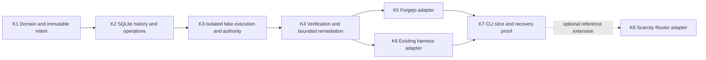

# Bounded Program Engine Successor

Status: proposed post-A0 program, **not executed by A0**. This replaces the implementation direction
of historical `Infrastructure/creatidy-autonomy#53`; it does not start that brief or rerun Program #62.
Acceptance below is required future evidence, not a list of tests already implemented.

## Implementation Graph

| Node | Owner and bounded delivery | Acceptance / stop condition |
| --- | --- | --- |
| K1 | Kernel: ProgramSpec, WorkUnit graph, immutable Attempt inputs, legal domain commands and policy/authority values | Reject cycles, missing inputs, out-of-envelope actions and stale revisions. Pure transition tests; no engine/framework dependency. Explicit spec amendment semantics. |
| K2 | Kernel: SQLite adapter, history/projections, idempotent command admission, outbox/Operation records, leases/fences, backup/export seam | Fault injection around every commit/send/receipt boundary; reopen and reconstruct without replaying effects; same-key/different-input rejected; real WAL configuration/version verified. No network inside transactions. |
| K3 | Kernel: fake Runtime plus Workspace/authority enforcement using an existing sandbox implementation | Isolated worker cannot read control state or owner credentials, mint grants or change gate policy. Exact operation/Attempt recovery, cancel races and stale workers tested. No custom sandbox or live paid inference. |
| K4 | Kernel: Candidate/Evidence/AcceptedResult, independent verification, findings/convergence and local outcome observations | Exact subjects, fresh reviewer context and identity, no form-only acceptance; synthetic two-WorkUnit flow covers A-F before live adapters. Finite time/resource budgets, pause versus HumanGate separation, unknown usage preserved. |
| K5 | Kernel: minimal Forgejo adapter for repository/change/check observations and authorized branch/push/PR effects | Shared fake/Forgejo contract suite with synthetic local forge; explicit domain receipts, pagination/absence semantics, duplicate/uncertain operation handling. No automatic merge in this slice. |
| K6 | Kernel: one existing coding harness adapter, initially Codex app-server | Version-pin and capability-negotiate start/observe/interrupt/retrieve/reconcile; verify observed identity and cold review. Missing recovery/attestation produces explicit unavailable/unknown. Native SDK/protocol only. |
| K7 | Kernel: one CLI over the application layer, disposable repository reference scenario, restart/recovery and package proof | Program -> READY WorkUnit -> FixedAllocator -> isolated runtime -> candidate -> independent verification -> accepted result -> next WorkUnit. Export outcome/evidence manifest, record consumption and owner interruptions. Offline suite mandatory; live provider use explicitly opt-in with a finite owner budget. |
| K8 (optional) | Kernel: ScarcityRouterAllocator over public recommendation API, then repeat the K7 reference scenario | Producer-shaped redacted fixtures, schema/version errors, `selected=null`, actual configured runtime compatibility, preserved rationale/provenance; no shadow routing. No reservation claimed where unsupported. Independent allocator integration is not a prerequisite for the first useful Kernel. |

Each node must freeze its threat model, finite execution budget, input/output contract and acceptance
tests before implementation. No node can silently widen scope to finish. Parallelize only independent
adapter work after the same core contract is stable. No direct source extraction from private repos.

## Program #62 Regression Corpus

The A-F incidents are reported in the owner brief and old v1 issue, not replayed here. Keep synthetic
producer-shaped fixtures and named regressions so the evidence survives model/harness changes.

| Lesson | Fixture / required assertion | First owner node |
| --- | --- | --- |
| A: healthy child classified stalled | Quiet worker with fresh authenticated activity and legitimate wait remains healthy/waiting. Timeout recovery targets the exact failed execution, never the oldest global request. Silence is not failure. | K3 |
| B: review intent confused with dispatch | Persist only intent, crash, restart: no accepted-review wait or WorkUnit advance. Delivery attempt and semantic receipt remain distinct. | K2 |
| C: malformed LLM review protocol | Malformed/extra/duplicate fields and invalid semantics cannot cause a transition. Code builds requests; parser round-trip is tested. Ordinary malformed output is autonomous remediation. | K3/K4 |
| D: transport succeeded, domain rejected | HTTP/tool/scheduler success carrying rejected/invalid domain status produces rejection, not acknowledged execution. Persist the actual rejection safely. | K2/K5 |
| E: waited for review never accepted | Missing, rejected, accepted and uncertain receipts are distinct. Wait requires a durable matching acceptance reference. Reconcile and redispatch only the same proven-safe original operation. | K2/K4 |
| F: ordinary new blocker demanded owner | Several different valid findings are automatically remediated within budget. Repeated/oscillating blockers are diagnosed; only new authority/judgment opens HumanGate, never a magic round count. | K4 |

Also require grant replay, worker privilege escalation, candidate-modified checks, missing artifacts,
stale head/base/policy, crash-after-remote-acceptance, duplicate usage and unavailable allocator tests.
Tests run without private M5-B, Prefect, live Forgejo or Scarcity Router; optional adapter integration
suites are additional, not a replacement for deterministic fakes.

## First Useful Vertical Slice

Complete K1-K7 for one locally operated finite Program with two dependent, owner-approved engineering
WorkUnits in a disposable repository. Use local SQLite/artifacts, Forgejo, FixedAllocator and one
existing harness. The recommended reference-stack extension is K8, repeating the same scenario with
the public Scarcity Router recommendation interface. The first accepted patch becomes an explicit
verified input to the next WorkUnit. Open a PR as the delivery artifact; **do not automatically merge
or deploy**. No UI is needed. Repeat with a deterministic fake runtime to prove
the optional products do not own Program semantics.

Measure attempts, consumed resources with units/source, first-pass acceptance, remediation and
interruptions; do not promise a cost improvement before real measurement. Show that controller restart
and lost harness context preserve Program truth and do not duplicate an uncertain external action.

## Separate Later Work

Private `creatidy-autonomy` can later expose M5-B/Prefect adapters and thin command clients while
preserving standalone review. `creatidy-onprem` can later supply deployment/backup/monitoring wiring
only. Neither is needed for public adoption. Do not change live private runtime behavior, convert
active Programs, bulk-import history, run a product pilot or remove old commands during A0/A1.

Automatic conditional merge needs its own exact-base/head race proof. REST/MCP entrances, other
harness/forge adapters, distributed execution, stronger isolation options, release publication and
adaptive Program-level allocation are subsequent bounded decisions, not hidden K7 acceptance work.
