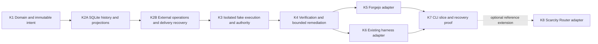

# Coverage And Delivery Roadmap

Current alignment: [Kernel #46](https://forgejo.creatidy.com/Creatidy/creatidy-kernel/issues/46),
[ADR 0007](../adr/0007-shared-harness-routing-observability.md). This is a requirement/evidence/issue
map, **not an execution queue or Program authorization**. Functional work is selected one issue at
a time, explicitly by the owner or under an explicit owner-invoked repository `/loop`. This map is
not invocation authority. The known full product scope is retained; a vertical proof or documentation
approval does not close missing requirements, authorize inference or mean `READY_FOR_LIVE_TASK`.

## Observation Basis

Kernel canonical Git/Forgejo `develop`, fetched 2026-10-04:
`eb4f4a2956712bfaf39a3271e1523e7f77a91e26`. This also equals the source's historical reference at
this observation, not a demand to keep an old base or proof of deployment. Source paths below are
relative to `src/creatidy_kernel/`; test definitions were inspected during the audit, with actual
executed gates recorded separately in #46/its PR. No product inference or live task was run.

K1-K8, neutral task support PR #38, frozen #166 support PR #43 and public operator PR #45 are
integrated bounded subsets. #15/#37/#44 remain open despite associated merged PRs; open labels
are not absence evidence. #34 closed `INFRASTRUCTURE_BLOCKED`, #39 closed `TASK_STALE`, neither
proves live success. Router #143/#166 are target identities, not Kernel issue numbers.

Public producer observations: Router
`8d9d4b04bcb23fe19ff702b6209fbcb1537cdf1b` and MI
`fb7299810fdc4612d4e0559465faef571662c6ef` (MI PR #10 merged during the audit). Producer branch/
merge metadata corroborated revisions; sibling working-tree equality was not independently proved.
MI's integrated synthetic knowledge/effective-view proof is not a publication product. Old unmerged
MI PR #4/#8 are not imported or labelled integrated.

## Requirement Coverage G01-G13

All rows derive from the owner's shared architecture v1.0 brief, source sections 1-8, 9.2-9.4,
10-18. Original G identifiers are analysis IDs, not issue numbers. The full source file was not
available, so exact missing subsection mapping is not invented. Every row has actual registered
work; combined coverage is explicit. Producer-only responsibilities are not duplicated as Kernel
implementation. **Verified** here means the named bounded source/tests, not the complete target.

| Gap / agreed requirement | Owner of Kernel slice | Verified current evidence / existing coverage | Documentation correction | Registered missing result |
| --- | --- | --- | --- | --- |
| G01 Existing harness control, permissions/progress/lifetime/recovery/process ownership | Kernel | `ports/execution.Runtime`, `adapters/codex_runtime`, `codex_stdio`; tests `test_codex_runtime.py`, `test_codex_stdio.py`; #8/PR #26 native subset, not shared supervisor | Runtime contract, README, reuse | [#47](https://forgejo.creatidy.com/Creatidy/creatidy-kernel/issues/47) bounded feasibility; [#48](https://forgejo.creatidy.com/Creatidy/creatidy-kernel/issues/48) current lifetime repair; [#53](https://forgejo.creatidy.com/Creatidy/creatidy-kernel/issues/53) proved adapter integration |
| G02 Ordinary issue preparation and approved versioned intake/freshness | Kernel | `adapters/task_execution.TaskSpec`, CLI `TASKS`, tests `test_task_preflight.py`, `test_task_166.py`; #31/#42 freeze examples; #32/#37 exclude ordinary ingestion | Task/authority contract and README | [#49](https://forgejo.creatidy.com/Creatidy/creatidy-kernel/issues/49) scope/requirements/recipes/approval and current issue/PR/source/test-baseline evidence |
| G03 Durable product review/remediation and exact candidate reception | Kernel | `core/verification.verify_candidate`, `remediation_action`, `test_verification.py`; #7 domain seam; task POLICY reviewer false; #15/#19 development only | Acceptance contract, README | [#54](https://forgejo.creatidy.com/Creatidy/creatidy-kernel/issues/54) review receipt/independence/findings/new Attempt/fresh exact-SHA acceptance |
| G04 Executable Router decision, sticky main route through harness/gateway/tools/recovery | Kernel consumer; Router producer | `adapters/scarcity_router.select`, `ports/allocation`, `test_allocation_recovery.py`; #11/PR #28 exclude gateway and prove only durable recommendation/no reselection | Allocator/runtime contract and migration | [#47](https://forgejo.creatidy.com/Creatidy/creatidy-kernel/issues/47) separate backend proof; [#52](https://forgejo.creatidy.com/Creatidy/creatidy-kernel/issues/52) consumer; Router [#174](https://forgejo.creatidy.com/BioMedical-IT/scarcity-router/issues/174) producer |
| G05 Approved quality/context/interface requirements, not reference/L0 guesses | Kernel task meaning/consumer; Router eligibility | `ports/application.py:97`, `adapters/scarcity_router.py:412-421`, preflight reference/128; #4 immutable intent and #11 narrow translator, not rich TaskSpec requirements | Task/allocator contract | [#49](https://forgejo.creatidy.com/Creatidy/creatidy-kernel/issues/49) approved input; [#51](https://forgejo.creatidy.com/Creatidy/creatidy-kernel/issues/51) preservation/translation; Router [#175](https://forgejo.creatidy.com/BioMedical-IT/scarcity-router/issues/175), MI [#14](https://forgejo.creatidy.com/Creatidy/model-intelligence/issues/14) producer semantics |
| G06 Knowledge/provenance reference retention, optional harness evidence | Kernel consumer; MI publication/Router consumption | Context/allocation artifacts in `ports/application`, #7 manifests/#11 provenance; no MI consumer. MI PR #10 synthetic proof has no published snapshot contract | Knowledge contract/target | [#55](https://forgejo.creatidy.com/Creatidy/creatidy-kernel/issues/55) Kernel references; MI [#13](https://forgejo.creatidy.com/Creatidy/model-intelligence/issues/13) publication and Router [#176](https://forgejo.creatidy.com/BioMedical-IT/scarcity-router/issues/176) consumption |
| G07 Versioned private full-outcome/cost export, causal limits | Kernel producer; Router optional consumer, MI optional privacy decision | `core/outcomes.export_outcomes`, `test_context_outcomes.py`, richer `reference_export`, thin `export_task_store`; #7/#10 foundations exclude analytics/telemetry | Export contract, README | [#58](https://forgejo.creatidy.com/Creatidy/creatidy-kernel/issues/58) complete export; Router [#177](https://forgejo.creatidy.com/BioMedical-IT/scarcity-router/issues/177) consumer; MI [#17](https://forgejo.creatidy.com/Creatidy/model-intelligence/issues/17) optional sharing, not local-path prerequisite |
| G08 Owner-served state/events/CLI/Console/IDE/notifications | Kernel producer; Console client | `sqlite_store` EXCLUSIVE owner connection, offline CLI status/export, doctor; `test_sqlite_store.py`, `test_selfcontained_operator.py`; #5/#10/#44 do not establish served events | State/operator/security contract | [#57](https://forgejo.creatidy.com/Creatidy/creatidy-kernel/issues/57) snapshot/position/dedupe/gap/buffer/correlation/current-authority commands/alerts. Console [#1 bootstrap](https://forgejo.creatidy.com/Creatidy/creatidy-console/issues/1) found at final check; specific consumer contract/receipt not yet found, no direct SQL |
| G09 Actual workspace/test/reviewer isolation and permission refusals | Kernel | `TrustMode`, native workspace-write/never, synthetic `test_fake_execution.py`; #6 excludes OS sandbox; verifier runs all checks before rejection | Threat model/SECURITY/verification contract | [#50](https://forgejo.creatidy.com/Creatidy/creatidy-kernel/issues/50) trusted preconditions and existing-sandbox denial proof; Router [#180](https://forgejo.creatidy.com/BioMedical-IT/scarcity-router/issues/180) owns native-workspace authority conflict |
| G10 Preserve identity/protocol/access-mode/effort and evidence strength | Kernel consumer; Router/harness producers | `RuntimeIdentity`, `identity_matches`, `test_reference_identity.py`, explicit D-057 effort; #8/#11/#35 subset; observed physical identity unknown, resource/access mode absent | Runtime/allocator/identity contract | [#52](https://forgejo.creatidy.com/Creatidy/creatidy-kernel/issues/52) consumer with #47/#53 harness version proof; Router [#179](https://forgejo.creatidy.com/BioMedical-IT/scarcity-router/issues/179) identity/effort, [#181](https://forgejo.creatidy.com/BioMedical-IT/scarcity-router/issues/181) ingress compatibility |
| G11 Many tasks, host-qualified cache/locks/ownership/manual edits/cleanup | Kernel | `source_cache.source_cache_key` path-only, SQLite one-writer, candidate/Attempt identities; `test_source_cache.py`; #13 local fences/#44 layout independent, not complete multi-task ownership | Workspace/state/migration contract | [#61](https://forgejo.creatidy.com/Creatidy/creatidy-kernel/issues/61) cache/dispatch identity; [#59](https://forgejo.creatidy.com/Creatidy/creatidy-kernel/issues/59) controllers/workspaces/manual changes/concurrent view |
| G12 Whole-task attempts/review/tools/retries/auxiliary budget and costs | Kernel aggregate authority; Router call enforcement | `BudgetPolicy` count limits, journal retry safety, per-command timeout, pure outcomes; #4/#7/#32 subsets, no complete consumption/enforcement | Execution/effect/cost contract | [#48](https://forgejo.creatidy.com/Creatidy/creatidy-kernel/issues/48) immediate deadline/freshness repair; [#56](https://forgejo.creatidy.com/Creatidy/creatidy-kernel/issues/56) full budget/retry/capture/unknown ledger; Router [#184](https://forgejo.creatidy.com/BioMedical-IT/scarcity-router/issues/184) enforcement facts |
| G13 Public contract/adapter distribution, durable/profile migration and platform lifecycle | Kernel consumer/distributor; each producer owns its versions | Versioned store/allocation codecs, package smoke, generic dotenv/SOPS and Linux-only storage; #5/#8/#11/#44 subsets, no real ciphertext migration or exercised platform matrix | Migration/delivery/operator contract | [#62](https://forgejo.creatidy.com/Creatidy/creatidy-kernel/issues/62) compatibility/install/ciphertext/state/platform; #61 hostless-cache migration; Router [#185](https://forgejo.creatidy.com/BioMedical-IT/scarcity-router/issues/185)/[#186](https://forgejo.creatidy.com/BioMedical-IT/scarcity-router/issues/186), MI [#18](https://forgejo.creatidy.com/Creatidy/model-intelligence/issues/18) producer obligations |

Every row also contributes to [#60 installed end-to-end reception](https://forgejo.creatidy.com/Creatidy/creatidy-kernel/issues/60).
That reception task cannot replace or implement missing component work. No full gap is closed by
the cited historical subsets; the acceptance-criteria differences above explain why new work is not
duplicate delivery. No producer-only calibration, publication, routing or Console implementation
has been registered as a Kernel implementation issue.

## First-Priority Deviations

These remain product defects/proof blockers even if the documentation PR is approved. Static code
facts are distinguished from unrun exploit/live scenarios. Closure requires behavior evidence, not
only changed prose or a green unrelated test suite.

| Current fact | User/integration consequence and urgency | Task / observable closure |
| --- | --- | --- |
| CLI `_task` retains its owned connection while active; failed/interrupted no-candidate finishes the Attempt; expiry/Ctrl-C have separate cancel journal/receipt/observations | #48 synthetic delayed-turn/restart/crash proof does not establish detached lifetime, shared-session handoff, interrupt delivery or remote descendant settlement. | [#48](https://forgejo.creatidy.com/Creatidy/creatidy-kernel/issues/48) bounded owned-session repair; #53 receives separately proved native integration |
| `run_task` enforces original deadline/version/mode/source on recovery; Runtime/check/admission timestamps are decision-time observations | Original envelope cannot be renewed by CLI defaults; expired work may be observed but not newly dispatched or accepted. Full call/tool/quota/cost enforcement remains absent. | #48 deterministic envelope/freshness refusal; [#56](https://forgejo.creatidy.com/Creatidy/creatidy-kernel/issues/56) whole-path budget and streaming byte/process bounds |
| #61 source repair uses a separate host-qualified namespace, stable acquisition/use lock, matched ownership metadata and shared local dispatch validation; unknown trees are preserved | Lease covers the validated exact-object copy, not a healthy model session. This trusted native-local protocol is not hostile same-UID isolation or complete multi-task control. | #61 synthetic two-host/port, forced process/thread interleavings, preservation/refusal and zero-start negatives; independent exact-HEAD reception remains the delivery gate. #59 still owns controllers/manual edits. |
| `verify_candidate` runs every check before rejection; TaskChecks executes candidate commands after changed-path failure; same-user environment is not sandbox | Out-of-scope candidate tooling can run before rejection; final no-PR assertion is not no-effect proof. | [#50](https://forgejo.creatidy.com/Creatidy/creatidy-kernel/issues/50): no-execution marker for rejected tooling and real sandbox/test/reviewer denials |
| Router request is reference/128 -> L0/empty minima, one native Codex binding, no gateway handoff | Task quality/context and Router-backed inference are unproved; recommendation cannot satisfy execution acceptance. | [#49](https://forgejo.creatidy.com/Creatidy/creatidy-kernel/issues/49)/[#51](https://forgejo.creatidy.com/Creatidy/creatidy-kernel/issues/51) approved requirements; [#47](https://forgejo.creatidy.com/Creatidy/creatidy-kernel/issues/47)/[#52](https://forgejo.creatidy.com/Creatidy/creatidy-kernel/issues/52) actual producer-consumer route proof |
| Task policy has reviewer false and no remediation dispatcher | Deterministic accepted candidate is not independent semantic review; manual development workflow cannot close product acceptance. | [#54](https://forgejo.creatidy.com/Creatidy/creatidy-kernel/issues/54): cold independent exact-SHA verdict, durable receipts and changed-candidate full reception |
| Active SQLite has exclusive connection; task export omits full identity/provenance/costs; no owner-served replay view | Console/concurrent status cannot assume DB access; users cannot inspect whole accepted-result journey. | [#57](https://forgejo.creatidy.com/Creatidy/creatidy-kernel/issues/57): view with reconnect/gap/current-authority commands without durability loss; [#58](https://forgejo.creatidy.com/Creatidy/creatidy-kernel/issues/58) complete versioned private export |
| Router D-063 native ZCode can edit admin-authorized workspace, while target places task workspace under Kernel/harness control | Existing code is not automatic compliance with new ownership; enabling both controllers can compete. Do not delete the working producer path here. | Router [#180](https://forgejo.creatidy.com/BioMedical-IT/scarcity-router/issues/180) explicit authority/migration decision, then #47/#50/#52 consumer receipt |

The further backlog includes MI publication references, full multidimensional accounting/exports,
many-task ownership/manual edits, safe data/profile migration, distribution/platform lifecycle and
installed acceptance. It is registered, not omitted as demo-only or minimum scope.

## Dependencies And Reception Order

1. Receive bounded harness/control/backend proof #47; independently repair current lifetime #48,
   verifier/isolation #50 and cache/source enforcement #61. These data/safety repairs need not wait
   for a complete Console or every future harness.
2. Prepare approved task meaning #49; agree producer vocabulary with Router #175 / MI #14, then
   preserve it in Kernel #51. No new hard-quality minima are guessed from issue prose.
3. Router #174 executable handoff follows exact-core correction #178, identity/effort #179 and
   affected native authority #180. Receive protocol/tool/partial-recovery evidence #181 and known
   cancellation #165. Kernel #52 persists the result; #53 integrates the proved harness. Research
   may run jointly, but implemented consumer receipt cannot precede producer conformance.
4. MI #13 publication semantics/integrity and #14 mapping precede Router #176 admitted consumption
   and Kernel #55 retained references. MI's data/value/rights and complete-publication work remains
   MI-owned; optional sharing #17 is not a prerequisite for local operation.
5. Kernel #54 durable review, #56 whole-task budget (Router #184 call facts), #58 local export
   (Router #177 optional consumption), #57 owner-served observation and #59 concurrency receive
   exact-subject and failure evidence. State-feed work in Router #183 and MI #16 is analogous,
   not a Kernel state substitute or mandate to design the entire Console. Newly discovered Console
   #1 owns bootstrap and consumer backlog registration; its broad documentation/gates AC do not
   establish snapshot/command conformance. Kernel #57 must receive an actual consumer contract.
6. #62 installation/contract/state/ciphertext migration accompanies each affected interface change;
   #60 receives the installed complete path. Producer migration/distribution stays Router #185/#186
   and MI #18/#19. Synthetic/component evidence and separately authorized live acceptance remain
   distinct; no release/deploy or `main` promotion is delegated.

Priorities in actual issues are dependency/risk-based: immediate safety repair, contract/admission
prerequisite, dependent integration and final reception. They are not execution labels or arbitrary
numerical deadlines. Each task specifies reuse review, negative/recovery cases, compatibility,
security/diagnostics and future inference/service/effect/owner decisions. Registration is not approval
to execute, select a library, set a budget or change authority.

## Actual Registered Deliveries

| Issue | Independently receivable result | Priority / prerequisite |
| --- | --- | --- |
| [#47](https://forgejo.creatidy.com/Creatidy/creatidy-kernel/issues/47) | Existing harness control and separate backend/gateway feasibility | First contract proof, no assumed ACP choice |
| [#48](https://forgejo.creatidy.com/Creatidy/creatidy-kernel/issues/48) | Existing task lifetime/original-envelope/cancel/freshness repair | Immediate live safety |
| [#49](https://forgejo.creatidy.com/Creatidy/creatidy-kernel/issues/49) | Ordinary prepared/versioned/approved spec and freshness | Admission prerequisite |
| [#50](https://forgejo.creatidy.com/Creatidy/creatidy-kernel/issues/50) | Trusted verifier preconditions and proved existing sandbox | Immediate untrusted-execution safety |
| [#51](https://forgejo.creatidy.com/Creatidy/creatidy-kernel/issues/51) | Meaningful monotone Router requirements | #49; Router #175/MI #14 semantics |
| [#52](https://forgejo.creatidy.com/Creatidy/creatidy-kernel/issues/52) | Sticky executable-route/identity consumer | #47/#51; producer #174/#179/#180/#181 |
| [#53](https://forgejo.creatidy.com/Creatidy/creatidy-kernel/issues/53) | Proved harness adapter/session integration | #47; #48/#50 accepted lifecycle/security |
| [#54](https://forgejo.creatidy.com/Creatidy/creatidy-kernel/issues/54) | Durable product review/remediation/acceptance | Approved spec, harness, isolation, budget policy |
| [#55](https://forgejo.creatidy.com/Creatidy/creatidy-kernel/issues/55) | Utilized MI reference/harness-evidence provenance | MI #13/Router #176 producer conformance |
| [#56](https://forgejo.creatidy.com/Creatidy/creatidy-kernel/issues/56) | Whole-task accounting/enforcement/hidden retries | #48/#49/#52/#54 facts; Router #184 |
| [#57](https://forgejo.creatidy.com/Creatidy/creatidy-kernel/issues/57) | Served state/progress/commands/notifications, useful CLI | Lifecycle/correlation/ownership; preserves SQLite |
| [#58](https://forgejo.creatidy.com/Creatidy/creatidy-kernel/issues/58) | Complete versioned private outcomes/cost export | #54/#56 identity/cost ledger; optional Router #177 |
| [#59](https://forgejo.creatidy.com/Creatidy/creatidy-kernel/issues/59) | Multiple-task workspace/controller/manual-edit reconciliation | #48/#50/#53/#61; #57 concurrent view |
| [#60](https://forgejo.creatidy.com/Creatidy/creatidy-kernel/issues/60) | Installed composed user-path reception, negative/live evidence | Actual component receipts and separately scoped live authority |
| [#61](https://forgejo.creatidy.com/Creatidy/creatidy-kernel/issues/61) | Host cache/locks/cleanup/source dispatch checks | Immediate data/identity safety; compatible migration |
| [#62](https://forgejo.creatidy.com/Creatidy/creatidy-kernel/issues/62) | Public install/platform/contract/state/profile compatibility | Accompany migrations, precede installed reception |

The documentation alignment itself is #46, not a functional parent granting execution. Existing
issue history is linked rather than retroactively broadened; no existing completed product delivery
is claimed to implement these new acceptance criteria.

## Necessary Owner Decisions

After bounded research, genuine decisions may include supervisor/process handoff and supported
permission/isolation level; Router #180 backend-native workspace authority/migration; contested
identity/plan-managed assurance or calibration ownership; public state authentication/retention where
not already governed; explicit numeric task/inference/effect budgets and privacy/export consent.
An unknown technical method, provider wait or routine reviewer finding is engineering work, not
automatically a HumanGate. No such decision is fabricated as resolved by the documentation mandate.

## Historical K1-K8 Plan

The original post-A0 graph and A-F corpus below are retained as decision history. Its implementation
direction replaced historical `Infrastructure/creatidy-autonomy#53`; it does not execute that brief
or rerun Program #62. K1-K8 now have delivered bounded subsets, **not every originally described
acceptance guarantee**. In particular K3 is not OS isolation, K4 is not a complete product review
dispatcher, K6 lacks physical observed identity and K7 is not full real-cost collection. Read the
current matrix above rather than this historical plan as a live queue or completeness claim.

## Implementation Graph

```mermaid
flowchart LR
    K1[K1 Domain and immutable intent] --> K2A[K2A SQLite history and projections]
    K2A --> K2B[K2B External operations and delivery recovery]
    K2B --> K3[K3 Isolated fake execution and authority]
    K3 --> K4[K4 Verification and bounded remediation]
    K4 --> K5[K5 Forgejo adapter]
    K4 --> K6[K6 Existing harness adapter]
    K5 --> K7[K7 CLI slice and recovery proof]
    K6 --> K7
    K7 -. optional reference extension .-> K8[K8 Scarcity Router adapter]
```

| Node | Owner and bounded delivery | Acceptance / stop condition |
| --- | --- | --- |
| K1 | Kernel: ProgramSpec, WorkUnit graph, immutable Attempt inputs, legal domain commands and policy/authority values | Reject cycles, missing inputs, out-of-envelope actions and stale revisions. Pure transition tests; no engine/framework dependency. Explicit spec amendment semantics. |
| K2A (#5) | Kernel: SQLite adapter for final K1 facts, explicit versioned records/codecs, append-only history, rebuildable projections, command admission, migration and backup/export | Round-trip all K1 facts; rebuild without current-command replay; same-key/same-input returns the recorded result and changed input fails closed; atomic history/dedupe/projection writes; reopen, migration, backup and runtime/topology evidence. No Operations/outbox or external effects. |
| K2B (#13) | Kernel: external Operation/outbox records, delivery attempts, leases/fences and reconciliation handoff | Fault injection around commit/send/receipt boundaries; restart preserves uncertainty without duplicate effects; no network inside transactions. |
| K3 | Kernel: fake Runtime plus Workspace/authority enforcement using an existing sandbox implementation | Isolated worker cannot read control state or owner credentials, mint grants or change gate policy. Exact operation/Attempt recovery, cancel races and stale workers tested. No custom sandbox or live paid inference. |
| K4 | Kernel: Candidate/Evidence/AcceptedResult, independent verification, findings/convergence and local outcome observations | Exact subjects, fresh reviewer context and identity, no form-only acceptance; synthetic two-WorkUnit flow covers A-F before live adapters. Finite time/resource budgets, pause versus HumanGate separation, unknown usage preserved. |
| K5 | Kernel: minimal Forgejo adapter for repository/change/check observations and authorized branch/push/PR effects | Shared fake/Forgejo contract suite with synthetic local forge; explicit domain receipts, pagination/absence semantics, duplicate/uncertain operation handling. No automatic merge in this slice. |
| K6 | Kernel: one existing coding harness adapter, initially Codex app-server | Version-pin and capability-negotiate start/observe/interrupt/retrieve/reconcile; verify observed identity and cold review. Missing recovery/attestation produces explicit unavailable/unknown. Native SDK/protocol only. |
| K7 | Kernel: one CLI over the application layer, disposable repository reference scenario, restart/recovery and package proof | Program -> READY WorkUnit -> FixedAllocator -> isolated runtime -> candidate -> independent verification -> accepted result -> next WorkUnit. Export outcome/evidence manifest, record consumption and owner interruptions. Offline suite mandatory; live provider use explicitly opt-in with a finite owner budget. |
| K8 (optional) | Kernel: ScarcityRouterAllocator over public recommendation API, then repeat the K7 reference scenario | Producer-shaped redacted fixtures, schema/version errors, `selected=null`, actual configured runtime compatibility, preserved rationale/provenance; no shadow routing. No reservation claimed where unsupported. Independent allocator integration is not a prerequisite for the first useful Kernel. |

Each node must freeze its threat model, finite execution budget, input/output contract and acceptance
tests before implementation. No node can silently widen scope to finish. Parallelize only independent
adapter work after the same core contract is stable. No direct source extraction from private repos.

## Program #62 Regression Corpus

The A-F incidents are reported in the owner brief and old v1 issue, not replayed here. Keep synthetic
producer-shaped fixtures and named regressions so the evidence survives model/harness changes.

| Lesson | Fixture / required assertion | First owner node |
| --- | --- | --- |
| A: healthy child classified stalled | Quiet worker with fresh authenticated activity and legitimate wait remains healthy/waiting. Timeout recovery targets the exact failed execution, never the oldest global request. Silence is not failure. | K3 |
| B: review intent confused with dispatch | Persist only intent, crash, restart: no accepted-review wait or WorkUnit advance. Delivery attempt and semantic receipt remain distinct. | K2 |
| C: malformed LLM review protocol | Malformed/extra/duplicate fields and invalid semantics cannot cause a transition. Code builds requests; parser round-trip is tested. Ordinary malformed output is autonomous remediation. | K3/K4 |
| D: transport succeeded, domain rejected | HTTP/tool/scheduler success carrying rejected/invalid domain status produces rejection, not acknowledged execution. Persist the actual rejection safely. | K2/K5 |
| E: waited for review never accepted | Missing, rejected, accepted and uncertain receipts are distinct. Wait requires a durable matching acceptance reference. Reconcile and redispatch only the same proven-safe original operation. | K2/K4 |
| F: ordinary new blocker demanded owner | Several different valid findings are automatically remediated within budget. Repeated/oscillating blockers are diagnosed; only new authority/judgment opens HumanGate, never a magic round count. | K4 |

Also require grant replay, worker privilege escalation, candidate-modified checks, missing artifacts,
stale head/base/policy, crash-after-remote-acceptance, duplicate usage and unavailable allocator tests.
Tests run without private M5-B, Prefect, live Forgejo or Scarcity Router; optional adapter integration
suites are additional, not a replacement for deterministic fakes.

## First Useful Vertical Slice

Complete K1-K7 for one locally operated finite Program with two dependent, owner-approved engineering
WorkUnits in a disposable repository. Use local SQLite/artifacts, Forgejo, FixedAllocator and one
existing harness. The recommended reference-stack extension is K8, repeating the same scenario with
the public Scarcity Router recommendation interface. The first accepted patch becomes an explicit
verified input to the next WorkUnit. Open a PR as the delivery artifact; **do not automatically merge
or deploy**. No UI is needed. Repeat with a deterministic fake runtime to prove
the optional products do not own Program semantics.

Measure attempts, consumed resources with units/source, first-pass acceptance, remediation and
interruptions; do not promise a cost improvement before real measurement. Show that controller restart
and lost harness context preserve Program truth and do not duplicate an uncertain external action.

## Historical Deferred Work

Private `creatidy-autonomy` can later expose M5-B/Prefect adapters and thin command clients while
preserving standalone review. `creatidy-onprem` can later supply deployment/backup/monitoring wiring
only. Neither is needed for public adoption. Do not change live private runtime behavior, convert
active Programs, bulk-import history, run a product pilot or remove old commands during A0/A1.

Automatic conditional merge needs its own exact-base/head race proof. REST/MCP entrances, other
harness/forge adapters, distributed execution, stronger isolation options, release publication and
adaptive Program-level allocation are subsequent bounded decisions, not hidden K7 acceptance work.
Known shared-architecture requirements now have actual registered tasks above; this historical
deferral is not permission to drop them. Automatic merge and private runtime conversion are not
selected by the documentation mandate.
