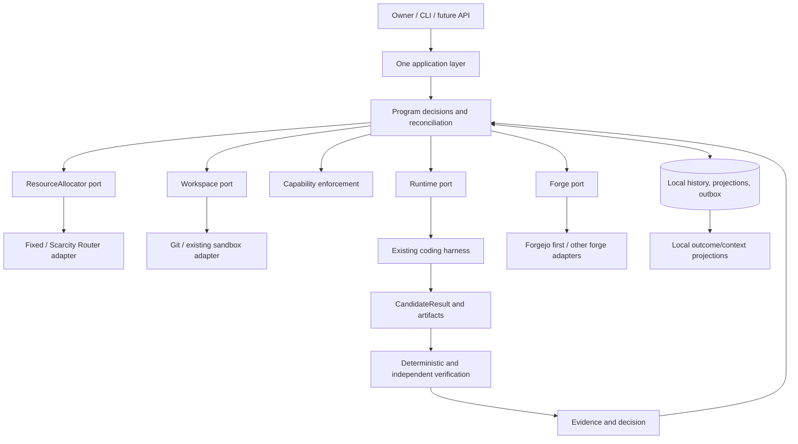

# Greenfield Target

This target was drafted before the current Creatidy implementation audit. ADRs distinguish accepted
architecture from the small A0 code proof. Nothing here claims an operational Program engine exists.

## Smallest Kernel

A local package that owns bounded Program intent, checks legal actions, durably records decisions,
reconciles external operations and accepts evidence-bound results. Existing coding runtimes do the
intelligent work. Existing Git, forges, CI, containers and allocators supply mechanisms.

These are responsibilities and call boundaries, not services. Initially there is one controller
process, a local SQLite database and local artifact storage. Workers are isolated external processes.
Context compilation, authority checking, verification orchestration and outcome projection belong
inside this package, not four new products.

## Authority Map

| State | Authority | Kernel representation |
| --- | --- | --- |
| Intent, Program graph, acceptance criteria, limits | Owner-approved versioned ProgramSpec | Durable snapshot and decision history |
| Legal actions, WorkUnit readiness, accepted outcomes, grants | Kernel application/domain layer | Atomic journal plus current projections |
| Commits, branches, issues, PRs, reviews, CI, merge | Selected forge/Git | Referenced external identities and timestamped observations, never fictitious authoritative copies |
| Runtime liveness, session identity, raw usage | Runtime / authenticated adapter observations | Receipts, freshness and uncertainty; completion does not imply acceptance |
| Quota and reservation reality | Allocator/provider | Versioned observation/receipt, not an invented global quota balance |
| Artifact contents | Content-addressed user storage / Git objects | Validated digests and manifests, not model prose |
| Secrets | User-selected existing credential store | References available only to the trusted broker |
| Search, embeddings, summaries, UI | Derived views | Rebuildable, never the only copy of truth |

An issue can represent a requirement or WorkUnit but is not the Program itself. Forge observations
do not directly set Kernel status. Authenticated domain commands validate and record their meaning.
Forge edits to requirements require a ProgramSpec amendment, not silent adoption by a worker.

## Vocabulary

Durable means represented in local history/storage, not necessarily its own table or class. IDs are
opaque within an installation; external identities are qualified by adapter/endpoint/repository.

| Concept | Meaning and owner | Identity / durability / lifecycle | Explicitly not |
| --- | --- | --- | --- |
| Objective | Owner's intended outcome within ProgramSpec | Versioned value, no independent lifecycle initially | An extra orchestration service |
| Program / ProgramSpec | Kernel's bounded graph and owner's immutable intent, criteria, resource/authority envelope | Program ID; spec revision+digest; draft, active, paused, completed or cancelled | A chat, ticket queue, generic workflow language, or harness session |
| WorkUnit | Kernel-owned bounded obligation and graph node, dependencies, required inputs/outputs and acceptance policy | ID scoped to Program; immutable spec revisions; pending, ready, active, accepted or cancelled | An Attempt or necessarily an issue |
| Attempt / AttemptSpec | One execution try with pinned inputs, allocation, agent definition, policy, workspace and context | New ID each try; immutable effective spec digest; prepared, executing, candidate, then accepted/rejected/failed/cancelled | A mutable session reused to erase failures; `Run` is only an upstream synonym |
| Operation | Kernel's record of one intended external effect and its delivery/observations | Stable ID, input digest and dedupe key; intent through receipt/observation to resolved disposition or uncertainty | Proof of effect merely because intent exists |
| Artifact | Produced or consumed bytes/Git object owned by the user | Digest plus locator, size/type; staged then durable, retained or explicitly collected | Evidence of correctness by existence alone |
| CandidateResult | Untrusted proposed output from an Attempt | Immutable candidate ID, spec and artifact subjects; pending verification, rejected or accepted by a separate decision | A trusted verdict |
| Evidence | Attributed observation about an exact subject | ID/digest, producer, tool/version, timestamps; immutable, may be superseded | A verdict or an authority grant |
| Finding | A specific unmet obligation identified by verification | ID, subject and stable/versioned fingerprint; open, resolved, superseded | Free-form status-setting instructions |
| AcceptedResult | Kernel's acceptance decision binding candidate, evidence, policy and spec | Durable decision ID; historical acceptance immutable; applicability can later be superseded/invalidated | Automatic merge, production deployment or universal correctness |
| Outcome | Local view of consumption and acceptance across related Attempts | Derived from durable observations/decisions, with correction lineage | Another source of workflow authority |
| ResourceRequest / Allocation | Requirement vector / allocator selection with rationale | Request identity and immutable selection snapshot; record before dispatch | A vendor-specific ranking or execution permission |
| Reservation | Optional allocator-owned hold with a validated receipt | External reference, units, expiry; acquired/released/expired/uncertain | A field claiming reserved capacity without an external hold |
| Budget / Policy | Owner's limits and decision rules | Version/digest; immutable values selected by a spec; superseded explicitly | Custom policy DSL or routing implementation |
| AuthorityGrant | Trusted broker's bounded delegation from owner authority | Grant ID and exact scope/digest; issued, consumed where single-use, expired or revoked | An agent claiming permission |
| HumanGate | A concrete owner judgment/authority requirement | ID, typed reason, subject digest and required decision; open/resolved/obsolete | Generic `needs_human`, a failed test, or a retry counter |
| Runtime / Workspace | Execution mechanism / reproducible execution environment | Adapter ID/version and external handle; provisioned/active/reconciled/disposed as appropriate | Program truth or automatic sandbox safety |
| ContextPackage | Bounded, source-pinned compiled input | Manifest digest and compiler/policy version; generated then retained or reproducible | Conversation history as project memory |
| Event / Decision | Durable fact / legal choice with reason | Journal ID, aggregate sequence, schema, actor, correlation and causation | Arbitrary row mutation or log parsing |

`Node` is not a second entity: the WorkUnit is the graph node. Do not add `task`, `job`, `child`, or
`run` as competing core synonyms. Runtime-specific vocabulary stays in adapters. The state labels
above express the target lifecycle; exact serialized enums/schema are deferred to the successor.

## Critical Invariants

1. Code, not LLM prose, determines transitions and authority. No `set_state` or `force_status` API.
2. Every dispatched Attempt has immutable inputs, a durable Operation and valid bounded authority.
3. State, history, command dedupe and pending effects commit atomically. No network I/O in that transaction.
4. Intent != dispatch != domain acknowledgement != external completion != engineering acceptance.
5. Unknown effects are reconciled before retry; leases/fences cannot magically stop external workers.
6. Only verified, exact-subject evidence can support acceptance. New head/remediation requires fresh checks.
7. Workers cannot mint owner authority, access control-plane storage, or weaken their own verification gates.
8. Recoverable defects/waits stay autonomous within budgets. HumanGate requires an actual decision.
9. Providers, runtimes, forges and allocators are replaceable. No private dependency or mandatory cloud.
10. Context and outcome history are user-owned; derived indexes and telemetry are not authoritative state.

## Legal Actions And Recovery

The first Program graph is a validated finite DAG, not arbitrary workflow code. Readiness requires
accepted predecessor outputs still applicable to the pinned spec. Planning can be assisted by an LLM,
but code checks cycles, references, scope, budgets and authority before activation. An amendment gets
a new spec revision and re-evaluates affected readiness/acceptance without deleting old decisions.

Examples of shared application operations: `start_program`, `next_action`, `report_candidate_result`,
`record_evidence`, `accept_result`, `request_external_operation`, `reconcile_operation`,
`grant_authority`, `record_owner_decision`. CLI, REST and MCP must not each implement those semantics.
Public transport routes and exact method signatures are deferred.

WorkUnit rejection does not require a new Program: a new Attempt can remediate within the same
obligation and authority envelope. A terminal Attempt is not reopened. Verification can use a fresh
independent runtime invocation with its own pinned specification and consumption. Acceptance updates
the WorkUnit and enables successors in one transaction. Resource/remote waiting and controller
health are conditions with receipts and next-observation deadlines, not guessed from chat activity.

On restart, load schema/policies, validate projections, recover pending operations, reconcile remote
reality, quarantine uncertain concurrent writes, and only then authorize new dispatches. Surviving
truth includes Program/spec graph, command dedupe, operation identities/receipts, authority grants,
Attempt inputs, candidate/evidence/artifact bindings, findings and consumption. A runtime transcript
may help continuity but losing it must not lose this truth.

## Explicit Limits

A0 implements only a resource-boundary proof. It does not implement the lifecycles above, SQLite
persistence, runtime/forge/sandbox adapters, context compilation or verification. There is no coding
agent, UI, deployment, adaptive router, general scheduler, new protocol or Program engine. The
[successor plan](successor.md) supplies the bounded implementation order and regression gates.
