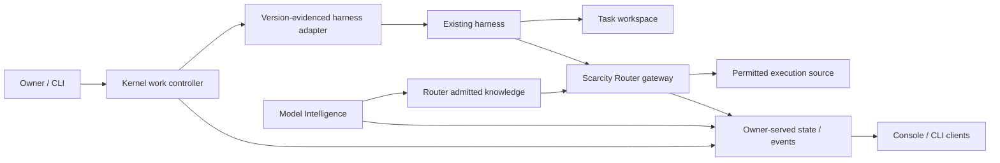
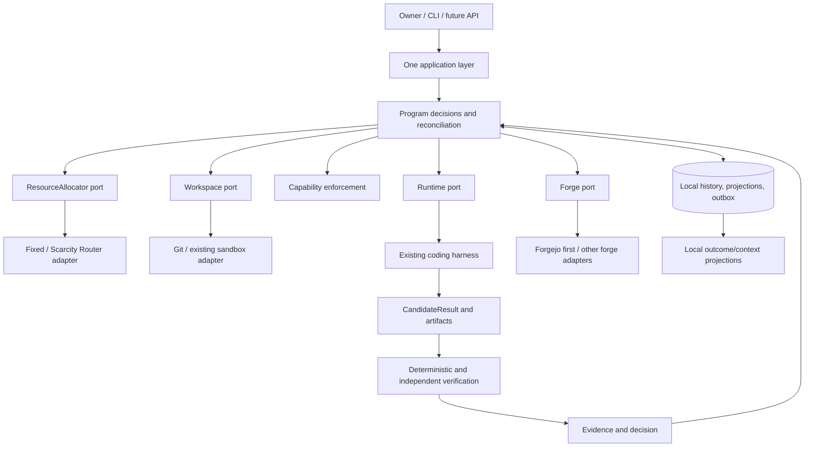

# Greenfield Target

The original target below predates the implementation audit. The current ownership direction is
[ADR 0007](../adr/0007-shared-harness-routing-observability.md); the
[coverage roadmap](successor.md) records revision-verified subsets and registered missing work.
Historical A0 exclusions are not descriptions of the entire current checkout. Nothing here claims
a complete operational Program engine or live shared integration.

## Shared System Target

**Agreed:** Kernel owns approved task intent/requirements/scope/authority, WorkUnit/Attempt inputs,
workspace/context, harness lifecycle, durable state, candidate verification/review/remediation,
external-effect reconciliation and outcome evidence. Existing harnesses own model-tool-result loops.
Router owns execution sources/accounts/pools, private telemetry, channel compatibility, cost and
selection/admission policy, gateway and provider execution. MI owns external evidence and versioned
knowledge publication; Console owns views and command forwarding, not scheduling/ranking/permissions
or direct producer-database access. See ADR 0007 for the source/status vocabulary and decision history.

```mermaid
flowchart LR
    Owner[Owner / CLI] --> Kernel[Kernel work controller]
    Kernel --> Adapter[Version-evidenced harness adapter]
    Adapter --> Harness[Existing harness]
    Harness --> Workspace[Task workspace]
    Harness --> Gateway[Scarcity Router gateway]
    Gateway --> Source[Permitted execution source]
    MI[Model Intelligence] --> Router[Router admitted knowledge]
    Router --> Gateway
    Kernel --> View[Owner-served state / events]
    Gateway --> View
    MI --> View
    View --> Console[Console / CLI clients]
```

This is a target responsibility diagram, not implemented API/dataflow or a service deployment. No
private onprem runtime is required; public modules may be dependencies when useful. The design does
not mandate four processes, a common package/ontology/database, broker or Kubernetes.

**Verified at Kernel `eb4f4a2956712bfaf39a3271e1523e7f77a91e26`:** immutable domain, dedicated-writer
SQLite, effects/artifacts, exact-subject verification, native Codex and Forgejo adapters, offline
reference and two frozen TaskSpecs/public operator exist. Router use is recommendation-only followed
by native Codex with one configured binding. General intake, gateway, product reviewer/remediation,
full-cost collection, owner-served events and hostile-code isolation are not delivered by those seams.

**To prove:** meaningful approved requirements precede admission, with fresh issue/source/PR/baseline
evidence. Issue/AGENTS/model prose cannot approve or widen a spec. Kernel controls an explicitly owned
harness session; real progress/permissions/cancel/resume/recovery/IDE attachment capabilities are
version-specific. ACP is a candidate, and its file/terminal executor must be identified. Opening a
workspace in an editor shows that workspace, not automatically the original checkout; neither UI
closure nor a native interrupt proves process or descendant lifetime.

**Agreed route semantics:** Router's dynamic executable decision is persisted before main dispatch
and bound to Attempt; explicit owner pin is an exception. Main calls do not silently reroute. Review
or helper roles can have separately authorized routes. Harness control and model-backend API
compatibility are different proofs. Provider/model/resource/access mode/explicit effort/opaque variant/
harness and versions remain separate with requested/resolved/observed/unknown evidence. Plan-managed
identity is weaker, not a physical-model inference. No pin is permission, reservation or response replay.

**Agreed acceptance/effect semantics:** every changed candidate gets fresh exact-SHA checks and
independent review; platform review and substantive verdict differ. Product review/remediation is
durable and budgeted, not repository `/finish-pr` or `/loop`. Intent/claim/dispatch/receipt/reconciliation
remain distinct; incomplete not-found or unknown outcome cannot justify retry or route change. SDK,
harness and gateway retries/auxiliary calls need correlation, accounting and uncertainty evidence.

**Agreed state/knowledge/cost semantics:** Kernel retains necessary durable facts; progress and
telemetry can be lossy without losing authority. CLI/Console get owner-served snapshots and bounded
reconnectable events, with cursor/dedup/gap/resync and task/Attempt/session/route/call/candidate
correlation. UI commands recheck current revision/grant in Kernel. Useful notifications concern real
states/decisions, not mandatory dashboard vigilance. MI normally feeds Router; utilized publication
references are retained, while direct harness evidence creates no ranking. Costs include all Attempts,
review/fixes/tests/tools/retries/helpers and distinguish money/quota/tokens/time/attention, estimates,
reports, measurements and unknowns. Local/private export is the default; PASS/APPROVE is conditional
evidence, not causal model quality.

**Proposed clarification:** a minimal owner-served view or controlled projection can preserve current
SQLite exclusivity without a new platform. Exact transport/auth/retention semantics and process handoff
require their owning issue and any necessary ADR/owner approval, not specification by diagram.

**To prove:** use maintained sandbox mechanisms for untrusted workers/tests/review, one mutating
controller per Attempt, manual-edit detection/journaling, host-qualified source ownership/locking and
safe cleanup. Migrations preserve actual ciphertext/state and immutable identities. Platform and
installed acceptance are evidence work, not XDG-default or package-build assumptions. All these known
requirements are registered in the roadmap; a vertical example does not replace them.

## Smallest Kernel

A local package that owns bounded Program intent, checks legal actions, durably records decisions,
reconciles external operations and accepts evidence-bound results. Existing coding runtimes do the
intelligent work. Existing Git, forges, CI, containers and allocators supply mechanisms.

```mermaid
flowchart TD
    O[Owner / CLI / future API] --> A[One application layer]
    A --> K[Program decisions and reconciliation]
    K <--> D[(Local history, projections, outbox)]
    K --> R[ResourceAllocator port]
    K --> C[Capability enforcement]
    K --> W[Workspace port]
    K --> X[Runtime port]
    K --> F[Forge port]
    R --> RA[Fixed / Scarcity Router adapter]
    W --> WA[Git / existing sandbox adapter]
    X --> XA[Existing coding harness]
    F --> FA[Forgejo first / other forge adapters]
    XA --> CR[CandidateResult and artifacts]
    CR --> V[Deterministic and independent verification]
    V --> E[Evidence and decision]
    E --> K
    D --> H[Local outcome/context projections]
```

These are responsibilities and call boundaries, not services. The bounded current topology has one
controller per store, a local SQLite database and local artifact storage. Target workers need proved
isolation; current trusted-development external processes do not provide it.
Context compilation, authority checking, verification orchestration and outcome projection belong
inside this package, not four new products.

## Authority Map

| State | Authority | Kernel representation |
| --- | --- | --- |
| Intent, Program graph, acceptance criteria, limits | Owner-approved versioned ProgramSpec | Durable snapshot and decision history |
| Legal actions, WorkUnit readiness, accepted outcomes, grants | Kernel application/domain layer | Atomic journal plus current projections |
| Commits, branches, issues, PRs, reviews, CI, merge | Selected forge/Git | Referenced external identities and timestamped observations, never fictitious authoritative copies |
| Runtime liveness, session identity, raw usage | Runtime / authenticated adapter observations | Receipts, freshness and uncertainty; completion does not imply acceptance |
| Quota and reservation reality | Allocator/provider | Versioned observation/receipt, not an invented global quota balance |
| Artifact contents | Content-addressed user storage / Git objects | Validated digests and manifests, not model prose |
| Secrets | User-selected existing credential store | References available only to the trusted broker |
| Search, embeddings, summaries, UI | Derived views | Rebuildable, never the only copy of truth |

An issue can represent a requirement or WorkUnit but is not the Program itself. Forge observations
do not directly set Kernel status. Authenticated domain commands validate and record their meaning.
Forge edits to requirements require a ProgramSpec amendment, not silent adoption by a worker.

## Vocabulary

Durable means represented in local history/storage, not necessarily its own table or class. IDs are
opaque within an installation; external identities are qualified by adapter/endpoint/repository.

| Concept | Meaning and owner | Identity / durability / lifecycle | Explicitly not |
| --- | --- | --- | --- |
| Objective | Owner's intended outcome within ProgramSpec | Versioned value, no independent lifecycle initially | An extra orchestration service |
| Program / ProgramSpec | Kernel's bounded graph and owner's immutable intent, criteria, resource/authority envelope | Program ID; spec revision+digest; draft, active, paused, completed or cancelled | A chat, ticket queue, generic workflow language, or harness session |
| WorkUnit | Kernel-owned bounded obligation and graph node, dependencies, required inputs/outputs and acceptance policy | ID scoped to Program; immutable spec revisions; pending, ready, active, accepted or cancelled | An Attempt or necessarily an issue |
| Attempt / AttemptSpec | One execution try with pinned inputs, allocation, agent definition, policy, workspace and context | New ID each try; immutable effective spec digest; prepared, executing, candidate, then accepted/rejected/failed/cancelled | A mutable session reused to erase failures; `Run` is only an upstream synonym |
| Operation | Kernel's record of one intended external effect and its delivery/observations | Stable ID, input digest and dedupe key; intent through receipt/observation to resolved disposition or uncertainty | Proof of effect merely because intent exists |
| Artifact | Produced or consumed bytes/Git object owned by the user | Digest plus locator, size/type; staged then durable, retained or explicitly collected | Evidence of correctness by existence alone |
| CandidateResult | Untrusted proposed output from an Attempt | Immutable candidate ID, spec and artifact subjects; pending verification, rejected or accepted by a separate decision | A trusted verdict |
| Evidence | Attributed observation about an exact subject | ID/digest, producer, tool/version, timestamps; immutable, may be superseded | A verdict or an authority grant |
| Finding | A specific unmet obligation identified by verification | ID, subject and stable/versioned fingerprint; open, resolved, superseded | Free-form status-setting instructions |
| AcceptedResult | Kernel's acceptance decision binding candidate, evidence, policy and spec | Durable decision ID; historical acceptance immutable; applicability can later be superseded/invalidated | Automatic merge, production deployment or universal correctness |
| Outcome | Local view of consumption and acceptance across related Attempts | Derived from durable observations/decisions, with correction lineage | Another source of workflow authority |
| ResourceRequest / Allocation | Requirement vector / allocator selection with rationale | Request identity and immutable selection snapshot; record before dispatch | A vendor-specific ranking or execution permission |
| Reservation | Optional allocator-owned hold with a validated receipt | External reference, units, expiry; acquired/released/expired/uncertain | A field claiming reserved capacity without an external hold |
| Budget / Policy | Owner's limits and decision rules | Version/digest; immutable values selected by a spec; superseded explicitly | Custom policy DSL or routing implementation |
| AuthorityGrant | Trusted broker's bounded delegation from owner authority | Grant ID and exact scope/digest; issued, consumed where single-use, expired or revoked | An agent claiming permission |
| HumanGate | A concrete owner judgment/authority requirement | ID, typed reason, subject digest and required decision; open/resolved/obsolete | Generic `needs_human`, a failed test, or a retry counter |
| Runtime / Workspace | Execution mechanism / reproducible execution environment | Adapter ID/version and external handle; provisioned/active/reconciled/disposed as appropriate | Program truth or automatic sandbox safety |
| ContextPackage | Bounded, source-pinned compiled input | Manifest digest and compiler/policy version; generated then retained or reproducible | Conversation history as project memory |
| Event / Decision | Durable fact / legal choice with reason | Journal ID, aggregate sequence, schema, actor, correlation and causation | Arbitrary row mutation or log parsing |

`Node` is not a second entity: the WorkUnit is the graph node. The public bounded `TaskSpec` is an
input contract, not a competing core WorkUnit/Attempt lifecycle. Do not add `job`, `child` or `run`
as competing core synonyms. Runtime vocabulary stays in adapters. The labels above are historical
target vocabulary; actual implemented enums/codecs determine serialized state, not this table.

## Critical Invariants

1. Code, not LLM prose, determines transitions and authority. No `set_state` or `force_status` API.
2. Every dispatched Attempt has immutable inputs, a durable Operation and valid bounded authority.
3. State, history, command dedupe and pending effects commit atomically. No network I/O in that transaction.
4. Intent != dispatch != domain acknowledgement != external completion != engineering acceptance.
5. Unknown effects are reconciled before retry; leases/fences cannot magically stop external workers.
6. Only verified, exact-subject evidence can support acceptance. New head/remediation requires fresh checks.
7. Workers cannot mint owner authority, access control-plane storage, or weaken their own verification gates.
8. Recoverable defects/waits stay autonomous within budgets. HumanGate requires an actual decision.
9. Providers, runtimes, forges and allocators are replaceable. No private dependency or mandatory cloud.
10. Context and outcome history are user-owned; derived indexes and telemetry are not authoritative state.

## Legal Actions And Recovery

The first Program graph is a validated finite DAG, not arbitrary workflow code. Readiness requires
accepted predecessor outputs still applicable to the pinned spec. Planning can be assisted by an LLM,
but code checks cycles, references, scope, budgets and authority before activation. An amendment gets
a new spec revision and re-evaluates affected readiness/acceptance without deleting old decisions.

Conceptual operation names, not working API/CLI instructions: `start_program`, `next_action`, `report_candidate_result`,
`record_evidence`, `accept_result`, `request_external_operation`, `reconcile_operation`,
`grant_authority`, `record_owner_decision`. CLI, REST and MCP must not each implement those semantics.
Public transport routes and exact method signatures are deferred.

WorkUnit rejection does not require a new Program: a new Attempt can remediate within the same
obligation and authority envelope. A terminal Attempt is not reopened. Verification can use a fresh
independent runtime invocation with its own pinned specification and consumption. Acceptance updates
the WorkUnit and enables successors in one transaction. Resource/remote waiting and controller
health are conditions with receipts and next-observation deadlines, not guessed from chat activity.

On restart, load schema/policies, validate projections, recover pending operations, reconcile remote
reality, quarantine uncertain concurrent writes, and only then authorize new dispatches. Surviving
truth includes Program/spec graph, command dedupe, operation identities/receipts, authority grants,
Attempt inputs, candidate/evidence/artifact bindings, findings and consumption. A runtime transcript
may help continuity but losing it must not lose this truth.

## Historical A0 Limits

A0 implemented only a resource-boundary proof. It did not implement the lifecycles above, SQLite
persistence, runtime/forge/sandbox adapters, context compilation or verification. There is no coding
agent, UI, deployment, adaptive router, general scheduler, new protocol or Program engine. The
[coverage roadmap](successor.md) separates subsequent built subsets from remaining acceptance and
registered work. Do not use this historical exclusion to erase code already delivered or known goals.
